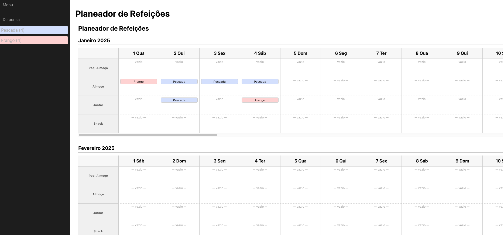

# Meal Planner - README



This repository contains a Meal Planning application, which includes:

- **Backend** in Spring Boot, responsible for:
    - **Meals** (meals associated with dates and types, such as breakfast, lunch, etc.).
    - **Pantry** (a list of items available for creating meals).
- **Frontend** in React, which consumes the backend endpoints to display the planning interface.

## Technologies Used

- **Java 17+** and **Spring Boot** for the backend.
- **Maven** for dependency management.
- **React** for the frontend.
- **Swagger/OpenAPI** for endpoint documentation (annotations in the code).

## How to Run

1. **Clone** this repository.
2. **Backend**:
    - Go to the backend folder (e.g., `meal-planner/`).
    - Run `mvn spring-boot:run` (or `mvn clean install` followed by `java -jar target/meal-planner.jar`).
    - The service will be available at `http://localhost:9998`.
3. **Frontend**:
    - Clone the frontend repository from [Meal Planner Frontend](https://github.com/MrW1cked/Meal-Planner-Front.git).
    - Go to the frontend folder.
    - Run `npm install` (or `yarn`) to install dependencies.
    - Run `npm start` to start the React application.
    - The interface will be available at `http://localhost:3000`.

## Available Endpoints

All endpoints are prefixed with `/api/v1/meals`.

### 1. **GET** `/api/v1/meals/year/{year}/all`
- **Description**: Returns all meals (`MealDTO`) for the specified year.
- **Parameters**:
    - **Path**: `year` (integer)
- **Example**: `GET /api/v1/meals/year/2025/all`
- **Responses**:
    - **200 OK**: List of `MealDTO`.
    - **404 Not Found**: If no meals are found for that year.
    - **500 Internal Server Error**: Server error.

### 2. **GET** `/api/v1/meals/pantry/all`
- **Description**: Returns all pantry items.
- **Responses**:
    - **200 OK**: List of `PantryDTO`.
    - **404 Not Found**: If no pantry items are found.
    - **500 Internal Server Error**: Server error.

### 3. **POST** `/api/v1/meals/pantry/add`
- **Description**: Adds a new item to the pantry.
- **Body (JSON)**: `PantryDTO`
- **Responses**:
    - **200 OK**: Success message.
    - **400 Bad Request**: Invalid data.
    - **500 Internal Server Error**: Server error.

### 4. **POST** `/api/v1/meals/add/{id}`
- **Description**: Creates a new meal from a pantry item, associating it with a specific date and meal type.
- **Parameters**:
    - **Path**: `id` (integer) – The pantry item ID.
    - **Query**:
        - `newDate` (LocalDate) – Date in `YYYY-MM-DD` format.
        - `mealType` (String) – Meal type (e.g., `BREAKFAST`, `LUNCH`, etc.).
- **Example**: `POST /api/v1/meals/add/10?newDate=2025-02-25&mealType=LUNCH`
- **Responses**:
    - **200 OK**: Success message.
    - **400 Bad Request**: Invalid or missing parameters.
    - **500 Internal Server Error**: Server error.

### 5. **PUT** `/api/v1/meals/update/{id}`
- **Description**: Moves an existing meal to a new date and meal type.
- **Parameters**:
    - **Path**: `id` (integer) – The meal ID (`MealDTO`).
    - **Query**:
        - `newDate` (LocalDate) – Date in `YYYY-MM-DD` format.
        - `mealType` (String) – Meal type.
- **Example**: `PUT /api/v1/meals/update/5?newDate=2025-02-26&mealType=DINNER`
- **Responses**:
    - **200 OK**: Success message.
    - **404 Not Found**: If the meal is not found.
    - **400 Bad Request**: Invalid data.
    - **500 Internal Server Error**: Server error.

### 6. **DELETE** `/api/v1/meals/delete/{id}`
- **Description**: Deletes a meal from a day.
- **Parameters**:
    - **Path**: `id` (integer) – The meal ID to delete.
- **Example**: `DELETE /api/v1/meals/delete/10`
- **Responses**:
    - **200 OK**: Success message.
    - **404 Not Found**: If the meal is not found.
    - **500 Internal Server Error**: Server error.

### 7. **POST** `/api/v1/meals/addPantryItem`
- **Description**: Adds a new pantry item.
- **Body (JSON)**: `PantryDTO`
- **Responses**:
    - **200 OK**: Success message.
    - **400 Bad Request**: Invalid data.
    - **500 Internal Server Error**: Server error.

## DTO Structures

### `MealDTO`
Example:
```json
{
  "id": 123,
  "date": "2025-02-25",
  "dayOfWeek": "TUESDAY",
  "mealType": "LUNCH",
  "itemType": "MEAT",
  "itemName": "Chicken",
  "itemColour": "#FFC0CB",
  "itemPrice": 0
}
```

### PantryDTO
Example:
```json
{
  "id": 999,
  "itemType": "MEAT",
  "itemName": "Chicken",
  "itemColour": "#FFC0CB",
  "itemPricePerDosis": 1.5,
  "itemTotalDosis": 10
}
```

## Project Structure

- **src/main/java**: Contains the Java source code for the backend.
    - **controllers**: REST controllers implementing the API endpoints.
    - **models/dto**: Data Transfer Objects (MealDTO, PantryDTO).
    - **models/enums**: Enumerations for meal types, item types, etc.
    - **repositories**: Spring Data JPA repositories.
    - **services**: Business logic.
- **src/main/resources**: Application properties, Flyway migration scripts, etc.

## Contributing

1. Fork the project.
2. Create a branch for your feature or bug fix (`git checkout -b feature/your-feature`).
3. Commit your changes.
4. Open a pull request.

## License

This project does not have a specified license. Please contact the maintainers for more information.

---

We hope this Meal Planner Backend is useful! If you have any questions or suggestions, please open an issue or contact the maintainers.

**Frontend Repository:** [Meal Planner Frontend](https://github.com/MrW1cked/Meal-Planner-Front.git)